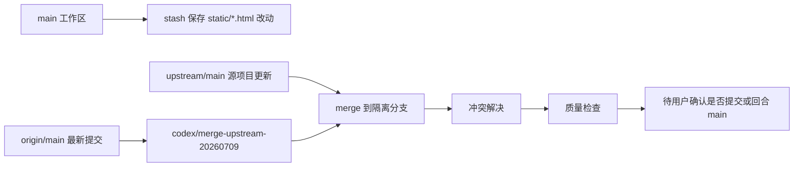
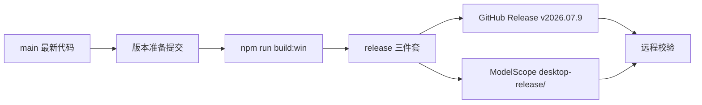

# 源项目更新合并设计

## 目标

在不破坏本地补丁集、不覆盖用户未提交改动的前提下，将源项目 `upstream/main` 的最新提交合入本仓库维护分支。

本次采用方案 1：保护当前未提交改动，在隔离分支完成合并和验证，不直接在 `main` 上解冲突。

## 当前仓库关系

- `origin`：本仓库远程，`https://github.com/xiaoqi0102/Infinite-Canvas.git`。
- `upstream`：源项目远程，`https://github.com/hero8152/Infinite-Canvas.git`。
- 本地 `main` 当前落后 `origin/main` 2 个提交。
- `upstream/main` 相对本地集成历史新增 2 个提交。
- 当前工作区存在 14 个已修改静态 HTML 文件，内容主要是 `?v=` 缓存版本号变化。

## 合并架构

### 分支策略

1. 保留本地 `main` 不动。
2. 将当前静态 HTML 未提交改动保存到 Git stash。
3. 从最新 `origin/main` 创建隔离分支，例如 `codex/merge-upstream-20260709`。
4. 在隔离分支执行 `git merge upstream/main`。
5. 在隔离分支解决冲突、运行验证、保留文档更新。

这样可以同时满足三个约束：

- 本地 `main` 不被半成品冲突污染。
- 用户当前未提交静态文件改动可从 stash 恢复。
- 合并基础包含 `origin/main` 已发布的客户端更新相关提交。

### 数据流

## 冲突处理原则

### `main.py`

合并上游新增修复，同时必须保留本地补丁：

- 视频任务化接口和轮询逻辑。
- `video_request_mode` 兼容 `/v1/videos/generations` 与 `/v1/video/generations`。
- WebDAV 云同步接口。
- 用户数据目录拆分：应用资源从 `APP_ROOT` 读取，用户数据写入 `USER_DATA_ROOT`。
- Electron 打包版静态资源跳过写入和用户数据迁移逻辑。

上游新增的灵境 API、即梦多参考图、视频返回字段 `detail`、视频比例修复等应按语义合入，而不是简单取某一边。

### `static/js/smart-canvas.js`

合并上游“来源比例自动适配 1k/2k/4k 尺寸”的修复，同时保留：

- 智能画布视频 pending 任务恢复。
- API 视频任务对象处理。
- 循环节点 UI 高度约束。
- RunningHub 和现有模型分支选择逻辑。

### 静态 HTML

这些文件大部分冲突来自缓存版本号。处理原则：

- 保留本地 `origin/main` 中已有页面入口、脚本引用和功能入口。
- `static/index.html` 必须保留 `cloud-sync` 入口和 `frame-cloud-sync`。
- 保留客户端安装包更新按钮和 Electron preload 相关入口。
- 缓存版本号统一使用合并后版本策略，避免混用旧 `2026.07.6` 与新 `2026.07.8`。
- 对上游有真实行为修复的页面逐项合入，例如 `static/gpt-chat.html` 中流式模式判断修复。

### 文档

保留并更新：

- `prd.md`
- `Design.md`
- `Tech.md`
- `UPSTREAM_MERGE_GUIDE.md` 中如发现新的冲突经验，可追加说明。

## 文件变更计划

### 新增文件

- `Design.md`：记录本次源项目合并设计、分支策略和冲突处理原则。
- `Tech.md`：记录技术规格、依赖约束、命令策略和验证标准。

### 已新增文件

- `prd.md`：记录本次维护需求、范围和验收标准。

### 预计修改文件

- `main.py`：合并上游 bug 修复，保留本地后端补丁集。
- `static/js/smart-canvas.js`：合并来源比例尺寸修复，保留本地智能画布任务与 UI 逻辑。
- `static/gpt-chat.html`：合入上游对图片模式流式判断的修复。
- `static/index.html`：合并缓存版本号和页面入口，保护云同步与客户端更新入口。
- `static/*.html`：统一处理缓存版本号冲突。
- `static/update-notes.json`：保留上游更新说明并检查版本号。
- `VERSION`：确认与 `origin/main` / `upstream/main` 一致。

### 预计不修改文件

- 用户数据目录、资产、输出、历史记录等运行数据。
- `release/`、`dist/`、`node_modules/` 等构建产物。

## 关键接口和结构保护

合并后必须继续存在以下关键符号或配置：

- `normalize_video_request_mode`
- `effective_video_request_mode`
- `video_submit_url_candidates`
- `video_task_url_candidates`
- `is_video_terminal_error`
- `resume_canvas_video_tasks_on_startup`
- `CLOUD_SYNC_SCHEMA`
- `public_cloud_sync_config`
- `apply_cloud_sync_payload`
- `USER_DATA_ROOT`
- `INFINITE_CANVAS_USER_DATA_DIR`
- `USER_WORKFLOW_DIR`
- `migrate_user_data_from_app_root`
- `ModelScopeClientUpdateProvider`
- `handleClientUpdateSourceFailure`
- `client-update-source-fallback`
- `deleteAppDataOnUninstall: false`

## 风险与权衡

- `main.py` 是最高风险文件，上游和本地均修改视频生成链路，必须按语义合并。
- 静态 HTML 冲突看似只是缓存版本号，但 `static/index.html` 还涉及本地页面入口，不能机械取上游。
- 当前静态 HTML 未提交改动会被 stash 保存，合并完成后不自动覆盖合并结果；如需恢复，需要单独审查后再应用。
- 本次不提交、不推送，除非用户后续明确要求。

## 客户端构建发布设计

### 目标

基于当前 `main` 发布新的 Windows Electron 客户端版本 `2026.07.9`，使已安装客户端可以通过安装包级自动更新获取新版本。

本次采用方案一：创建新的 `v2026.07.9` GitHub Release，并同步发布到 ModelScope `desktop-release/` 兜底目录。

### 发布架构

### 版本策略

- 将 `VERSION` 从 `2026.07.8` 升到 `2026.07.9`。
- 运行 `npm run sync:desktop-version` 同步 `package.json.version`、`package-lock.json` 和 `build.win.artifactName`。
- `static/update-notes.json` 更新到 `2026.07.09`，说明本次客户端发布包含源项目更新合并与桌面客户端重建。
- 使用 release tag `v2026.07.9`，不在 `VERSION` 中写前导 `v`。

### 发布目标

1. GitHub Release：`xiaoqi0102/Infinite-Canvas`，tag 为 `v2026.07.9`。
2. ModelScope Studio：`xiaoqi0102/Infinite-Canvas`，目录为 `desktop-release/`。

两个渠道必须上传同名三件套：

- `Infinite-Canvas-Setup-2026.07.9.exe`
- `Infinite-Canvas-Setup-2026.07.9.exe.blockmap`
- `latest.yml`

### 发布顺序

1. 确认工作区干净、`VERSION` 为 `2026.07.9`、远端不存在 `v2026.07.9`。
2. 执行构建前语法检查和 `npm run sync:desktop-version`，确认版本元数据一致。
3. 如版本元数据或发布说明有变化，先提交并推送 `main` 到 `origin/main`。
4. 构建 Windows 客户端。
5. 校验本地 `release/` 三件套。
6. 创建 GitHub Release 并上传三件套。
7. 按顺序上传 ModelScope：安装包、`.blockmap`、`latest.yml`。
8. 校验 GitHub Release 资产和 ModelScope 文件 API。

### 风险控制

- 不复用 `v2026.07.8`，避免客户端自动更新无法识别同版本覆盖。
- `latest.yml` 必须最后上传到 ModelScope，避免旧客户端提前看到新元数据。
- 构建前保持工作区干净，构建产物位于被忽略的 `release/` 和 `dist/`。
- 如果构建或上传任一步失败，停止发布并报告，不继续暴露不完整更新。

## 变更历史

### 2026-07-16 - 新增 MegabyAI `/v1/videos` 独立视频协议

**变更内容**：新增 `megabyai-v1-videos` provider 模式，复用本地画布视频任务、持久化和恢复能力，独立适配 `/v1/videos` 创建/查询资源、参考素材公网化、参数边界、结果解析和鉴权下载；官方线路 `newapi.megabyai.cc` 与国内优化线路 `cn.megabyai.cc` 均通过精确 hostname 白名单自动识别。

**变更理由**：MegabyAI 的路径及 `referenceImages/referenceVideos/referenceAudios` 请求体与现有两个 OpenAI generations 模式均不兼容，独立模式可以避免修改旧协议造成回归。

**影响范围**：API provider 配置、普通画布和智能画布视频参数、后端视频提交与轮询、结果下载及视频轮询维护文档；本地 `/api/canvas-video-tasks` 契约保持不变。

**安全决策**：拒绝 `asset://`、本机和内网素材地址；本地素材仅通过既有受控路径解析及云端上传能力转换为公网 URL；Bearer Token 仅在下载地址与 provider Base URL 同源时发送，外部 CDN 永不携带凭据。

**已知限制**：远程素材的真实大小和总时长无法在提交前可靠验证，继续由上游校验；未使用真实付费 API Key 执行生成测试。

### 2026-07-16 - 新增 Sudashui 独立视频协议

**变更内容**：在现有视频任务化链路中新增 `sudashui-video-generations`，复用 provider 鉴权、任务持久化、轮询、恢复和结果保存；单独适配字符串化 `metadata.payload`、Sudashui 文件上传和官方真人素材索引。普通画布与智能画布共用协议工具，分辨率根据模型名称只读显示，但不发送给上游。

**变更理由**：Sudashui 与现有单数 OpenAI 视频接口路径相同，但请求体、素材上传和官方素材规则不同。独立模式可避免修改旧协议导致其它平台回归，同时集中共享前端规则，避免两套画布重复实现。

**影响范围**：API provider 配置、普通画布和智能画布视频参数、视频创建请求、素材上传、结果与错误解析、视频补丁重放文档。现有 `openai-videos-generations`、`openai-video-generations` 的请求体保持不变。

**安全决策**：只上传经过既有根目录约束解析的本地素材；公网 URL 原样提交，不由服务端主动下载，避免新增 SSRF 面；拒绝 `asset://`、不受控本地路径和不支持的 MIME/大小；API Key 只通过 Bearer Header 发送且不记录；视频创建请求不自动重发，避免重复扣费。单任务上传结果仅内存去重，不跨任务持久化。

**已知限制**：模型名不包含分辨率 token 时仅显示“模型自动”；公网素材的文件大小、时长和像素限制由上游校验；真人素材由用户显式填写图片编号，不进行自动人脸识别。

### 2026-07-13 - 客户端更新提示改为应用内弹窗

**变更内容**：将发现客户端安装包更新时的 Electron 原生消息框替换为应用内模态框；增加受限的 `client-update:available` 通知和 `client-update:respond` 响应桥接，显示版本、发布说明、当前下载源及自动备用源；侧栏客户端更新入口在收到真实的新版本事件后切换为绿色提示，并显示目标版本，用户选择“稍后”后继续保留提醒。

**变更理由**：统一客户端更新提示与项目现有源码更新弹窗的视觉和信息层级，并让用户在下载前明确看到双源兜底状态。

**影响范围**：`electron/main.js` 的下载确认流程、`electron/preload.js` 的最小 IPC 桥接、`static/index.html` 的客户端更新模态框；下载进度窗口、失败自动切源、下载后安装确认和用户数据保护逻辑保持不变。

**决策依据**：下载源状态以主进程真实更新检查结果为准，不在渲染进程重复发起测速或允许网页直接操作 `electron-updater`；这可避免展示伪造延迟数据并维持上下文隔离。

### 2026-07-13 - 客户端更新弹窗完整复刻内置更新交互

**变更内容**：客户端安装包更新弹窗改为与内置更新一致的双源可选结构，补充 GitHub / ModelScope 安装包节点的实时连通性检测、逐行延迟状态、自动推荐可用更快来源和右下角重新测试入口；下载确认会携带用户最终选择的来源。

**变更理由**：原客户端弹窗仅展示“当前源 / 自动备用源”的静态状态，无法让用户根据本机网络主动选源，也缺少内置更新已有的连通性反馈，视觉和交互均未完整统一。

**影响范围**：`static/index.html` 的客户端更新 UI 与状态机、`electron/preload.js` 的白名单探测/响应桥接、`electron/main.js` 的客户端专属节点探测和选源后重新检查流程；下载进度窗口、安装确认、用户数据保护与双源失败兜底保持不变。

**决策依据**：安装包测速必须针对 `xiaoqi0102/Infinite-Canvas` 的 GitHub Release 与 ModelScope `desktop-release`，不能复用源码更新地址。网络探测和更新器切源仍由 Electron 主进程执行，渲染进程只能提交当前弹窗 `requestId`、白名单目标 ID 与 `github | modelscope`，继续保持 `contextIsolation: true`、`nodeIntegration: false` 和最小 IPC 暴露。
