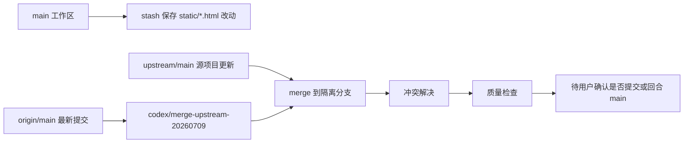

# 源项目更新合并设计

## 目标

在不破坏本地补丁集、不覆盖用户未提交改动的前提下，将源项目 `upstream/main` 的最新提交合入本仓库维护分支。

本次采用方案 1：保护当前未提交改动，在隔离分支完成合并和验证，不直接在 `main` 上解冲突。

## 当前仓库关系

- `origin`：本仓库远程，`https://github.com/xiaoqi0102/Infinite-Canvas.git`。
- `upstream`：源项目远程，`https://github.com/hero8152/Infinite-Canvas.git`。
- 本地 `main` 当前落后 `origin/main` 2 个提交。
- `upstream/main` 相对本地集成历史新增 2 个提交。
- 当前工作区存在 14 个已修改静态 HTML 文件，内容主要是 `?v=` 缓存版本号变化。

## 合并架构

### 分支策略

1. 保留本地 `main` 不动。
2. 将当前静态 HTML 未提交改动保存到 Git stash。
3. 从最新 `origin/main` 创建隔离分支，例如 `codex/merge-upstream-20260709`。
4. 在隔离分支执行 `git merge upstream/main`。
5. 在隔离分支解决冲突、运行验证、保留文档更新。

这样可以同时满足三个约束：

- 本地 `main` 不被半成品冲突污染。
- 用户当前未提交静态文件改动可从 stash 恢复。
- 合并基础包含 `origin/main` 已发布的客户端更新相关提交。

### 数据流

## 冲突处理原则

### `main.py`

合并上游新增修复，同时必须保留本地补丁：

- 视频任务化接口和轮询逻辑。
- `video_request_mode` 兼容 `/v1/videos/generations` 与 `/v1/video/generations`。
- WebDAV 云同步接口。
- 用户数据目录拆分：应用资源从 `APP_ROOT` 读取，用户数据写入 `USER_DATA_ROOT`。
- Electron 打包版静态资源跳过写入和用户数据迁移逻辑。

上游新增的灵境 API、即梦多参考图、视频返回字段 `detail`、视频比例修复等应按语义合入，而不是简单取某一边。

### `static/js/smart-canvas.js`

合并上游“来源比例自动适配 1k/2k/4k 尺寸”的修复，同时保留：

- 智能画布视频 pending 任务恢复。
- API 视频任务对象处理。
- 循环节点 UI 高度约束。
- RunningHub 和现有模型分支选择逻辑。

### 静态 HTML

这些文件大部分冲突来自缓存版本号。处理原则：

- 保留本地 `origin/main` 中已有页面入口、脚本引用和功能入口。
- `static/index.html` 必须保留 `cloud-sync` 入口和 `frame-cloud-sync`。
- 保留客户端安装包更新按钮和 Electron preload 相关入口。
- 缓存版本号统一使用合并后版本策略，避免混用旧 `2026.07.6` 与新 `2026.07.8`。
- 对上游有真实行为修复的页面逐项合入，例如 `static/gpt-chat.html` 中流式模式判断修复。

### 文档

保留并更新：

- `prd.md`
- `Design.md`
- `Tech.md`
- `UPSTREAM_MERGE_GUIDE.md` 中如发现新的冲突经验，可追加说明。

## 文件变更计划

### 新增文件

- `Design.md`：记录本次源项目合并设计、分支策略和冲突处理原则。
- `Tech.md`：记录技术规格、依赖约束、命令策略和验证标准。

### 已新增文件

- `prd.md`：记录本次维护需求、范围和验收标准。

### 预计修改文件

- `main.py`：合并上游 bug 修复，保留本地后端补丁集。
- `static/js/smart-canvas.js`：合并来源比例尺寸修复，保留本地智能画布任务与 UI 逻辑。
- `static/gpt-chat.html`：合入上游对图片模式流式判断的修复。
- `static/index.html`：合并缓存版本号和页面入口，保护云同步与客户端更新入口。
- `static/*.html`：统一处理缓存版本号冲突。
- `static/update-notes.json`：保留上游更新说明并检查版本号。
- `VERSION`：确认与 `origin/main` / `upstream/main` 一致。

### 预计不修改文件

- 用户数据目录、资产、输出、历史记录等运行数据。
- `release/`、`dist/`、`node_modules/` 等构建产物。

## 关键接口和结构保护

合并后必须继续存在以下关键符号或配置：

- `normalize_video_request_mode`
- `effective_video_request_mode`
- `video_submit_url_candidates`
- `video_task_url_candidates`
- `is_video_terminal_error`
- `resume_canvas_video_tasks_on_startup`
- `CLOUD_SYNC_SCHEMA`
- `public_cloud_sync_config`
- `apply_cloud_sync_payload`
- `USER_DATA_ROOT`
- `INFINITE_CANVAS_USER_DATA_DIR`
- `USER_WORKFLOW_DIR`
- `migrate_user_data_from_app_root`
- `ModelScopeClientUpdateProvider`
- `handleClientUpdateSourceFailure`
- `client-update-source-fallback`
- `deleteAppDataOnUninstall: false`

## 风险与权衡

- `main.py` 是最高风险文件，上游和本地均修改视频生成链路，必须按语义合并。
- 静态 HTML 冲突看似只是缓存版本号，但 `static/index.html` 还涉及本地页面入口，不能机械取上游。
- 当前静态 HTML 未提交改动会被 stash 保存，合并完成后不自动覆盖合并结果；如需恢复，需要单独审查后再应用。
- 本次不提交、不推送，除非用户后续明确要求。
