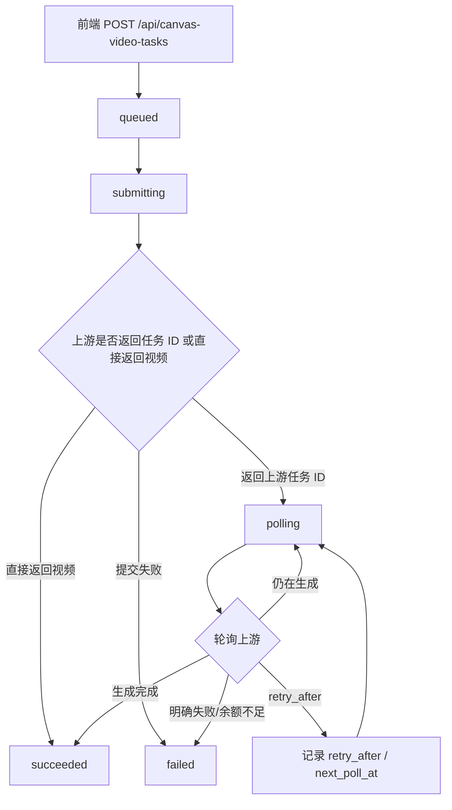

# 视频生成接口与轮询逻辑改动详解

本文档记录当前项目中“视频生成接口选择、视频任务提交、轮询查询、失败终止、刷新/重启恢复、补丁脚本重放”相关改动。目标是方便后续同步上游项目、增加新的视频生成中转站、排查“上游接口错误/余额不足/任务不结束”等问题。

## 1. 背景与目标

原先视频生成路径主要存在两个问题：

1. 前端直接请求 `/api/canvas-video`，这是一个长请求。视频生成耗时较长时，刷新页面、后端重启、网络断开都会导致前端丢失任务状态。
2. 某些上游会在轮询阶段返回明确的终态错误，例如余额不足、额度不足、支付/账单问题。如果仍把这类错误当作“可稍后查询”的任务，就会出现前端一直 pending，无法正确终止。

本次改动后的目标：

- 保留同步兼容接口 `/api/canvas-video`，但普通画布和智能画布的主流程改走任务化接口。
- 新增本地任务接口：
  - 提交：`POST /api/canvas-video-tasks`
  - 查询：`GET /api/canvas-video-tasks/{task_id}`
- 前端先保存本地 pending 状态，再轮询本地任务接口；刷新页面或后端重启后，能尽量恢复查询。
- 后端查询上游视频任务时固定以 25 秒为基础间隔，避免轮询过快导致上游失败或拒绝；前端仍每 5 秒刷新本地任务状态。
- 识别余额不足等终态错误，直接失败并清理 pending，不再无限等待。
- 旧核心任务化与 OpenAI/Sudashui 模式可通过 `tools/patches/video_request_mode_patch.py` 辅助重放；插件化 provider 必须按合并指南单独核对。

## 2. 文件总览

| 文件 | 作用 |
| --- | --- |
| `main.py` | 后端视频接口模式、上游提交/查询 URL、视频任务持久化、启动恢复、轮询、错误识别。 |
| `static/js/canvas.js` | 普通画布视频节点提交本地任务、保存 pending、5 秒轮询、失败/完成处理、手动查询。 |
| `static/js/smart-canvas.js` | 智能画布视频生成改为任务化，支持 pending 恢复、手动查询、终态错误终止。 |
| `static/api-settings.html` | API 设置页增加视频接口原生下拉。 |
| `static/js/api-settings.js` | 保存/读取 `video_request_mode`，展示 `videos` / `video` 接口模式。 |
| `tools/patches/video_request_mode_patch.py` | 旧核心任务化与 OpenAI/Sudashui 模式的辅助重放脚本，不覆盖后续插件化 provider。 |
| `重放视频接口补丁.bat` | Windows 下运行补丁脚本的入口。 |

## 3. 对外接口

### 3.1 保留的同步接口

```http
POST /api/canvas-video
Content-Type: application/json
```

用途：

- 兼容旧调用。
- 后端内部仍通过 `build_canvas_video_result(payload)` 完整执行提交和等待。
- 不适合作为前端主流程，因为它是一个长请求。

### 3.2 新增任务化提交接口

```http
POST /api/canvas-video-tasks
Content-Type: application/json
```

请求体复用 `CanvasVideoRequest`：

```json
{
  "prompt": "一段视频提示词",
  "provider_id": "comfly",
  "model": "veo3-fast",
  "duration": 5,
  "aspect_ratio": "16:9",
  "resolution": "",
  "images": [],
  "videos": [],
  "audios": [],
  "enhance_prompt": false,
  "enable_upsample": false,
  "watermark": false,
  "camerafixed": false,
  "generate_audio": false,
  "multimodal": false,
  "trusted_asset": false
}
```

成功响应：

```json
{
  "task_id": "canvas_video_xxxxxxxxxxxxxxxxxxxxxxxxxxxxxxxx",
  "status": "queued"
}
```

特点：

- 接口立即返回本地任务 ID。
- 后端通过 `asyncio.create_task(run_canvas_video_task(task_id, payload))` 在后台继续执行。
- 前端保存本地 pending 以后再轮询，避免刷新页面后任务状态完全丢失。

### 3.3 新增任务查询接口

```http
GET /api/canvas-video-tasks/{task_id}
```

可能响应：

```json
{
  "id": "canvas_video_xxx",
  "type": "online-video",
  "status": "polling",
  "created_at": 1760000000.0,
  "updated_at": 1760000005.0,
  "result": null,
  "videos": [],
  "error": "",
  "provider_id": "comfly",
  "model": "veo3-fast",
  "request": {
    "prompt": "...",
    "provider_id": "comfly",
    "model": "veo3-fast",
    "duration": 5,
    "aspect_ratio": "16:9",
    "resolution": "",
    "image_count": 1,
    "video_count": 0,
    "audio_count": 0
  },
  "upstream_task_id": "task_xxx",
  "submit_url": "https://example.com/v1/videos/generations",
  "retry_after": null,
  "next_poll_at": null,
  "raw_submit": {},
  "raw_last": {}
}
```

终态成功：

```json
{
  "status": "succeeded",
  "result": {
    "videos": ["/output/video-xxx.mp4"],
    "task_id": "upstream_task_id",
    "raw": {}
  },
  "videos": ["/output/video-xxx.mp4"],
  "error": ""
}
```

终态失败：

```json
{
  "status": "failed",
  "error": "视频生成任务失败：Insufficient credits...",
  "status_code": 402,
  "retry_after": null,
  "next_poll_at": null
}
```

## 4. API 设置页的视频接口选择

API 设置页保留原生 `<select>`，对应文件：

- `static/api-settings.html`
- `static/js/api-settings.js`
- `main.py`

下拉选项：

```html
<select id="videoRequestModeInput" title="视频接口">
  <option value="openai-videos-generations">视频：videos</option>
  <option value="openai-video-generations">视频：video</option>
</select>
```

### 4.1 两种模式的含义

| UI 显示 | 保存值 | 提交接口 | 查询接口 |
| --- | --- | --- | --- |
| 视频：videos | `openai-videos-generations` | `/v1/videos/generations` | `/v1/videos/generations/{task_id}`，并兼容 `/v1/tasks/{task_id}`、`/v2/videos/generations/{task_id}` |
| 视频：video | `openai-video-generations` | `/v1/video/generations` | `/v1/video/generations/{task_id}` |

用户当前提到的中转站接口：

```text
提交接口：/v1/video/generations
查询接口：/v1/video/generations/{task_id}
```

应选择：

```text
视频：video
```

也就是保存值：

```json
{
  "video_request_mode": "openai-video-generations"
}
```

### 4.2 默认值与兼容别名

前端 `normalizeVideoRequestMode(value)` 与后端 `normalize_video_request_mode(value)` 都做了兼容：

- `openai-video`
- `single-video`
- `video-generations`

都会归一为：

```text
openai-video-generations
```

以下值：

- `openai-videos`
- `videos-generations`

都会归一为：

```text
openai-videos-generations
```

默认值为：

```text
openai-videos-generations
```

## 5. 后端视频任务模型

### 5.1 本地任务 ID 与上游任务 ID

本地任务 ID：

```text
canvas_video_{uuid}
```

用于前端查询本项目后端：

```http
GET /api/canvas-video-tasks/canvas_video_xxx
```

上游任务 ID：

```text
upstream_task_id / task_id / submit_id / video_id
```

用于后端向中转站或上游平台查询真实生成进度。

二者不要混淆：

- 前端普通轮询应拿本地 `canvas_video_xxx` 查询 `/api/canvas-video-tasks/{task_id}`。
- 后端内部拿 `upstream_task_id` 查询上游。
- 手动恢复时，如果是本地视频任务，优先用本地任务 ID；不要直接把上游 ID 当成本地接口 ID。

### 5.2 任务字段

`POST /api/canvas-video-tasks` 创建任务时，后端写入类似结构：

```python
task = {
    "id": task_id,
    "type": "online-video",
    "status": "queued",
    "created_at": time.time(),
    "updated_at": time.time(),
    "result": None,
    "videos": [],
    "error": "",
    "provider_id": payload.provider_id,
    "model": payload.model,
    "request": video_task_request_meta(payload),
    "upstream_task_id": "",
    "submit_url": "",
    "retry_after": None,
    "next_poll_at": None
}
```

重要字段说明：

| 字段 | 含义 |
| --- | --- |
| `id` | 本地任务 ID，前端轮询使用。 |
| `type` | 固定为 `online-video`，用于区分普通图片任务。 |
| `status` | `queued`、`submitting`、`polling`、`succeeded`、`failed` 等。 |
| `result` | 成功后的完整结果。 |
| `videos` | 提取出来的本地视频 URL 列表。 |
| `error` | 失败原因。 |
| `provider_id` | 使用的视频平台。 |
| `model` | 使用的视频模型。 |
| `request` | 简化后的请求元信息，用于日志/恢复/排查。 |
| `upstream_task_id` | 上游平台返回的任务 ID。 |
| `submit_url` | 实际命中的上游提交接口。 |
| `retry_after` | 上游要求下次查询等待的秒数。 |
| `next_poll_at` | 后端预计下一次查询时间戳。 |
| `raw_submit` | 上游提交阶段原始响应。 |
| `raw_last` | 最近一次上游查询原始响应。 |

### 5.3 状态流转



## 6. 后端上游接口选择逻辑

### 6.1 Base URL 归一

`video_api_root(provider)` 会先处理 Base URL：

- 如果是火山方舟，保留方舟路径逻辑。
- 只规范化 URL 的路径部分，不会破坏 `https://`；路径内重复斜杠会折叠，并循环移除末尾重复的 `/v1`、`/v2` 版本段，后续再统一拼接。
- 该运行时根地址不会回写 provider 配置；前端保存值仍只由 `normalize_provider()` 去除首尾空白和尾斜杠，因此保留用户填写的单个 `/v1`，首次规范化后继续保存保持稳定。
- 五个独立视频插件共用同一套根地址规则。上游响应中的 `/v1/...`、`v1/...`、`/v2/...`、`v2/...` 相对下载路径会基于 provider 根地址补成绝对 URL；`/output/`、`/assets/` 本地路径保持不变。

例如：

```text
https://api.example.com//v1/v1/
```

归一为：

```text
https://api.example.com
```

然后再拼接：

```text
https://api.example.com/v1/video/generations
```

### 6.2 提交 URL 候选

`video_submit_url_candidates(provider, base_url)` 根据平台和 `video_request_mode` 返回提交 URL。

普通 OpenAI 兼容中转：

```python
if video_request_mode == "openai-video-generations":
    return [f"{base_url}/v1/video/generations"]
return [f"{base_url}/v1/videos/generations", f"{base_url}/v2/videos/generations"]
```

特殊平台有自己的路径：

| 平台 | 提交接口 |
| --- | --- |
| Agnes | `/v1/videos` |
| APIMart | `/v1/videos/generations` 或 `/videos/generations` |
| 火山方舟 | `/api/v3/contents/generations/tasks` |
| 玉玉 API 原生 | `/v1/video/create` |
| RunningHub / 即梦 | 平台自己的生成逻辑 |

### 6.3 查询 URL 候选

`video_task_url_candidates(provider, base_url, task_id, submit_url)` 根据平台和提交 URL 返回查询 URL。

对用户当前这种中转站：

```python
if video_request_mode == "openai-video-generations":
    return [f"{base_url}/v1/video/generations/{quoted_id}"]
```

对默认 `videos` 模式：

```python
v1_task = f"{base_url}/v1/videos/generations/{quoted_id}"
v1_generic_task = f"{base_url}/v1/tasks/{quoted_id}"
v2_task = f"{base_url}/v2/videos/generations/{quoted_id}"
```

如果提交阶段命中 `/v2/videos/generations`，查询时会优先尝试 `/v2/videos/generations/{id}`。

## 7. 后端轮询逻辑

### 7.1 全局超时

后端视频轮询超时由环境变量控制：

```python
VIDEO_POLL_TIMEOUT = float(os.getenv("VIDEO_POLL_TIMEOUT", "7200"))
```

默认：

```text
7200 秒，也就是 2 小时
```

### 7.2 轮询间隔

后端统一常量：

```python
VIDEO_POLL_INTERVAL = 25.0
```

通用视频轮询：

```python
delay = VIDEO_POLL_INTERVAL
```

Agnes 视频轮询：

```python
delay = VIDEO_POLL_INTERVAL
```

RunningHub 视频任务和服务重启后的即梦视频续查也使用该常量。

前端普通画布视频轮询：

```javascript
await sleep(5000);
```

前端智能画布视频轮询：

```javascript
await sleep(5000);
```

结论：

```text
后端查询上游视频任务时以 25 秒为基础间隔；前端查询本地任务状态时保持 5 秒刷新。
```

### 7.3 后端固定基础间隔

通用视频任务和 Agnes 视频任务在没有 `retry_after` 时保持 25 秒间隔：

```python
delay = VIDEO_POLL_INTERVAL
```

如果上游返回更长的 `retry_after`，后端会采用更长的等待时间；上游返回小于 25 秒的值时，仍至少等待 25 秒。

### 7.4 retry_after 支持

`video_retry_after_seconds(source)` 会从多个地方识别等待时间：

- HTTP 响应头：
  - `Retry-After`
- JSON 字段：
  - `retry_after`
  - `retryAfter`
  - `wait_seconds`
  - `waitSeconds`
  - `seconds`
  - `delay`
- 文本提示：
  - `retry_after: 10`
  - `请等待 10 秒`
  - `10 秒后再试`
  - `retry after 10 seconds`

识别到以后，后端会更新本地任务：

```json
{
  "status": "polling",
  "retry_after": 10,
  "next_poll_at": 1760000010.0,
  "raw_last": {}
}
```

其中 `retry_after` 保留上游返回的原始值，`next_poll_at` 按实际等待时间计算；例如上游返回 `10` 秒时，实际仍至少等待 25 秒。

注意：

- `retry_after` 是上游节流/排队提示，不等于失败。
- 但如果响应同时是余额不足等终态错误，终态错误优先，不会因为 `retry_after` 继续轮询。

## 8. 终态错误识别

### 8.1 解决的问题

用户遇到过类似错误：

```json
{
  "error": {
    "message": "Insufficient credits. Need ~20, remaining 13.00",
    "type": "insufficient_quota",
    "estimated_cost": 20,
    "credits_remaining": 13
  }
}
```

这类错误不是“任务还在生成”，而是明确失败。如果前端仍保留 pending，就会造成任务不终止。

### 8.2 后端识别规则

`is_video_terminal_error(source)` 会递归扫描 JSON、异常、响应文本，命中以下关键词即认为是终态错误：

```text
insufficient_quota
insufficient credits
credits_remaining
not enough credits
quota exceeded
payment required
billing
余额不足
额度不足
```

### 8.3 后端处理位置

在 `wait_for_video_task()` 中：

1. 如果 HTTP 状态码是 4xx/5xx，并且响应内容命中终态错误，立即抛出 `HTTPException`。
2. 如果捕获到异常，并且异常内容命中终态错误，立即抛出。
3. 如果轮询返回 JSON 内容命中终态错误，立即失败。

Agnes 的 `wait_for_agnes_video_task()` 同样有这套逻辑。

### 8.4 前端智能画布终态错误

智能画布里还有一层前端判断：

```javascript
function isSmartTerminalTaskError(message){
    const text = String(message || '').toLowerCase();
    return /(insufficient[_\s-]*quota|insufficient\s+credits?|credits[_\s-]*remaining|not\s+enough\s+credits?|quota\s+exceeded|payment\s+required|billing[_\s-]*(?:error|failed|failure|disabled|issue|problem)|billing\s+account\s+(?:disabled|inactive|suspended)|余额不足|额度不足)/i.test(text);
}
```

用途：

- 如果失败是余额不足等终态错误，就直接失败。
- 如果失败里带有上游任务 ID，但不是终态错误，则保留可恢复查询状态。

## 9. 普通画布视频流程

对应文件：

```text
static/js/canvas.js
```

### 9.1 提交流程

视频节点运行时，`runVideoNode()` 构造 payload：

```javascript
const payload = {
    prompt,
    provider_id: resolveVideoProviderId(node.apiProvider || 'comfly'),
    model: node.model || 'veo3-fast',
    duration: Number(node.duration || 5),
    aspect_ratio: node.aspectRatio || '16:9',
    resolution: node.resolution || '',
    images: refs,
    videos: manualVideoUrl ? [manualVideoUrl] : videoRefs.map(...),
    audios: audioRefs.map(ref => ref.url).filter(Boolean),
    enhance_prompt: Boolean(node.enhancePrompt),
    enable_upsample: Boolean(node.enableUpsample),
    watermark: Boolean(node.watermark),
    camerafixed: Boolean(node.cameraFixed),
    generate_audio: Boolean(node.generateAudio),
    multimodal: Boolean(node.multimodal)
}
```

然后调用：

```javascript
taskInfo = await createCanvasVideoTask(payload, {cascadeTargetId});
```

`createCanvasVideoTask()` 请求：

```javascript
POST /api/canvas-video-tasks
```

### 9.2 pending 保存

创建任务成功后，普通画布会把 pending 写入输出节点：

```javascript
makePendingForRun(pendingId, run, node, {refs, cascadeTargetId}, {
    canvasTaskId: taskInfo.task_id,
    canvasTaskType: 'online-video',
    providerId: payload.provider_id,
    model: payload.model,
    appendGenerated: Boolean(opts.cascade)
})
```

然后立即保存画布：

```javascript
scheduleSave();
await saveCanvas();
```

这一步很关键：

- 只要本地任务 ID 保存进画布，刷新页面后仍然能看到 pending。
- 后端重启后，如果持久化任务里有上游任务 ID，也能恢复查询。

### 9.3 轮询流程

普通画布轮询函数：

```javascript
pollCanvasVideoTask(taskId, options={})
```

行为：

1. 防重复：如果 `activeCanvasTaskPolls` 里已有同一个 taskId，直接返回 `running`。
2. 找 pending：`findPendingTask(taskId)`。
3. 请求本地查询接口：

```javascript
GET /api/canvas-video-tasks/{taskId}
```

4. 更新 pending 元信息：

```javascript
found.pending.canvasTaskStatus = data.status || 'polling';
found.pending.recoverTaskId = data.upstream_task_id || data.task_id || data.submit_id || found.pending.recoverTaskId || '';
found.pending.retryAfter = data.retry_after || null;
found.pending.nextPollAt = data.next_poll_at || null;
```

5. 成功时调用：

```javascript
completeCanvasVideoTask(taskId, data.result || data);
```

6. 失败时调用：

```javascript
failCanvasVideoTask(taskId, data.error || tr('canvas.videoFailed'), data);
```

后端返回 `status: "failed"` 时，该状态是权威终态。`failCanvasVideoTask()` 会移除对应 pending、
释放生成节点状态并让一键运行抛出错误停止后续节点。只有前端查询请求本身异常、且后端没有返回
明确任务终态时，才保留任务 ID 和“查询结果”入口。

7. 非终态继续等待：

```javascript
await sleep(5000);
```

### 9.4 完成处理

`completeCanvasVideoTask(taskId, result)`：

- 从 result 中提取视频 URL。
- 移除 pending。
- 把视频作为 `kind: 'video'` 添加到输出节点。
- 合并到生成节点输出。
- 写入生成日志。
- 调用 `scheduleSave()` 保存。

### 9.5 手动查询

普通画布里的“可恢复任务”手动查询函数：

```javascript
queryRecoverPendingOutput(pendingId)
```

视频任务分支会优先用本地任务 ID：

```javascript
const taskId = pending.canvasTaskType === 'online-video'
    ? (pending.canvasTaskId || pending.recoverTaskId || '')
    : ...
```

然后请求：

```javascript
GET /api/canvas-video-tasks/{taskId}
```

如果仍在生成：

- 清除 failed 标记。
- 更新状态。
- 重新启动 `pollCanvasVideoTask()`。

如果后端确认失败，则调用 `failCanvasVideoTask()` 清理 pending；旧画布里已经保存为失败的
视频 pending 会在加载后重新查询一次，以便确认成功、继续轮询或清理终态失败。图片任务的
可恢复行为不受影响。

## 10. 智能画布视频流程

对应文件：

```text
static/js/smart-canvas.js
```

### 10.1 任务提交

新增函数：

```javascript
async function createSmartCanvasVideoTask(payload){
    const res = await fetch('/api/canvas-video-tasks', {
        method:'POST',
        headers:{'Content-Type':'application/json'},
        body:JSON.stringify(payload)
    });
    if(!res.ok) throw new Error(await smartResponseErrorMessage(res, tr('smart.errRunFailed')));
    return res.json();
}
```

`runApiVideoGeneration()` 不再直接请求旧的长请求接口 `/api/canvas-video`，而是：

```javascript
const task = await createSmartCanvasVideoTask(payload);
const taskId = task?.task_id || task?.id || '';
if(!taskId) throw new Error(tr('smart.errRunFailed'));
return {
    taskIds: [taskId],
    count: 1,
    providerId: payload.provider_id,
    model: payload.model,
    kind: 'video'
};
```

### 10.2 主按钮运行流程

智能画布的 `runGeneration()` 已经把 API-like 视频纳入图片任务同款 pending 流程：

```javascript
const taskKind = outImages.kind || 'image';
pendingNode.pendingTasks = taskIds.map(taskId => ({
    taskId,
    kind: taskKind,
    providerId: outImages.providerId,
    model: outImages.model
}));
```

视频情况下：

```javascript
taskKind === 'video'
```

并且 expected count 固定为 1：

```javascript
isApiLikeEngine(settings.engine) && settings.apiKind === 'video' ? 1 : ...
```

### 10.3 智能画布视频轮询

新增函数：

```javascript
async function pollSmartCanvasVideoTask(taskId)
```

核心行为：

1. 防重复：复用 `activeSmartTaskPolls`。
2. 最多循环 1440 次，即按 5 秒间隔覆盖 2 小时。
3. 每次等待 5 秒：

```javascript
await sleep(5000);
```

4. 请求本地查询接口：

```javascript
GET /api/canvas-video-tasks/{taskId}
```

5. 成功：

```javascript
if(task.status === 'succeeded') return task.result || task;
```

6. 失败：

```javascript
if(task.status === 'failed'){
    const error = new Error(task.error || tr('smart.errRunFailed'));
    error.requestDetails = task.request_details || null;
    error.canvasTaskFailed = true;
    throw error;
}
```

后端查询接口会先恢复旧版本误写为失败、且已确认属于查询网络异常的任务，因此前端收到的
`failed` 是权威终态。智能画布收到该状态后必须立即停止轮询、移除对应 `pendingTasks` 并释放
节点运行状态；不能再根据错误文案把审核失败、参数失败等业务失败重新标记为“任务未丢失”。
手动查询若确认视频任务失败，也执行相同清理，使节点可以再次运行。图片任务仍保留原有的
可恢复任务逻辑。

### 10.4 智能画布恢复 pending

`resumeSmartPendingNode(node, logContext={})` 会按任务类型选择轮询函数：

```javascript
const taskKind = task.kind || 'image';
const result = taskKind === 'video'
    ? await pollSmartCanvasVideoTask(task.taskId)
    : await pollSmartCanvasTask(task.taskId);
```

视频结果提取：

```javascript
const media = taskKind === 'video'
    ? (result?.videos?.length ? result.videos : (result?.result || result))
    : ...
```

然后统一调用：

```javascript
finalizeSmartPendingTask(node, task.taskId, resultMediaUrls(media), taskKind);
```

旧画布若保存过带 `failed` 标记的视频 pending，加载时仍会查询一次本地任务；若后端确认失败，
立即移除该 pending，避免节点永久保持不可运行。图片的可恢复失败记录继续等待用户手动查询。

### 10.5 智能画布手动查询

函数：

```javascript
querySmartImageTaskNow(nodeId, localTaskId)
```

虽然函数名仍包含 Image，但现在已支持视频分支：

```javascript
if(task.kind === 'video'){
    const res = await fetch(`/api/canvas-video-tasks/${encodeURIComponent(task.taskId || localTaskId)}`);
    ...
}
```

要点：

- 视频手动查询使用本地任务 ID。
- 成功后调用 `finalizeSmartPendingTask(..., 'video')`。
- 仍在生成时重新启动 `pollSmartCanvasVideoTask()`。
- 失败时显示错误、移除对应 pending，并释放节点运行状态。

## 11. 后端持久化与重启恢复

### 11.1 持久化文件

视频任务会写入数据目录中的持久化文件。相关函数：

- `canvas_video_task_snapshot_unlocked()`
- `write_canvas_video_tasks_snapshot(snapshot)`
- `persist_canvas_video_tasks()`
- `load_persisted_canvas_video_tasks()`
- `load_canvas_video_tasks_into_memory()`

每次 `update_canvas_video_task()` 默认都会持久化。

### 11.2 启动恢复

应用启动时调用：

```python
await resume_canvas_video_tasks_on_startup()
```

恢复逻辑：

1. 读取持久化任务。
2. 跳过终态任务：
   - `succeeded`
   - `failed`
   - 其他终态
3. 只恢复可继续查询的任务。
4. 如果已有上游任务 ID，则：

```python
update_canvas_video_task(task_id, {
    "status": "polling",
    "message": "服务重启后已恢复视频任务查询"
})
asyncio.create_task(run_canvas_video_task(task_id, resume=True))
```

5. 如果没有上游任务 ID，则不自动重提，直接失败：

```text
服务重启前尚未拿到上游视频任务 ID，已停止自动恢复以避免重复扣费。
```

这条规则非常重要：
没有上游任务 ID 时，无法判断上游是否已经扣费/创建任务，自动重新提交可能导致重复扣费。

## 12. 普通画布与智能画布差异

| 项目 | 普通画布 `canvas.js` | 智能画布 `smart-canvas.js` |
| --- | --- | --- |
| 提交函数 | `createCanvasVideoTask()` | `createSmartCanvasVideoTask()` |
| 查询接口 | `/api/canvas-video-tasks/{taskId}` | `/api/canvas-video-tasks/{taskId}` |
| pending 存储 | 输出节点 `_pending` | 节点 `pendingTasks` |
| 视频轮询函数 | `pollCanvasVideoTask()` | `pollSmartCanvasVideoTask()` |
| 轮询间隔 | 5 秒 | 5 秒 |
| 防重复轮询 | `activeCanvasTaskPolls` | `activeSmartTaskPolls` |
| 成功处理 | `completeCanvasVideoTask()` | `finalizeSmartPendingTask(..., 'video')` |
| 失败处理 | `failCanvasVideoTask()` | 终态错误直接失败；非终态可恢复错误保留 recoverTaskId |
| 手动查询 | `queryRecoverPendingOutput()` | `querySmartImageTaskNow()` 视频分支 |

## 13. 为什么前端仍然有“长等待”

任务化后，前端不再用一个 HTTP 长请求等待 `/api/canvas-video` 完成，而是：

1. 短请求提交本地任务。
2. 保存 pending。
3. 通过多个短请求轮询本地任务。

但在一次运行函数内部，前端仍可能 `await pollCanvasVideoTask()` 或 `await resumeSmartPendingNode()`，这是为了当前交互流程能在结果完成后自动落盘和刷新 UI。

关键区别：

- 刷新前：轮询函数在内存中继续跑。
- 刷新后：pending 已保存，页面重新加载后可以恢复。
- 后端重启后：如果本地任务已持久化并拿到上游任务 ID，后端会继续查上游。

## 14. 补丁脚本说明

补丁脚本：

```text
tools/patches/video_request_mode_patch.py
```

Windows 入口：

```bat
重放视频接口补丁.bat
```

### 14.1 脚本覆盖内容

脚本会尝试同步以下内容：

- API 设置页视频接口下拉。
- `video_request_mode` 字段保存/读取。
- 后端 `/v1/videos/generations` 与 `/v1/video/generations` 模式切换。
- 视频任务本地化接口 `/api/canvas-video-tasks`。
- 后端任务持久化和启动恢复。
- 后端 `retry_after` 与终态错误识别。
- 普通画布视频任务化轮询。
- 智能画布视频任务化轮询。

该脚本不覆盖 `plugins/video_plugins/` 中的 MegabyAI、GeekNow、Tudou、aicost 等后续独立协议，也不会完整重建对应的前端模型约束。同步上游后必须按 `UPSTREAM_MERGE_GUIDE.md` 逐项保留这些插件、注册入口、i18n 和画布适配，不能把脚本成功当作全部视频能力已恢复。

### 14.2 推荐使用方式

更新原项目后：

```bat
重放视频接口补丁.bat
```

只检查不修改：

```bat
重放视频接口补丁.bat -DryRun -SkipChecks
```

如果输出：

```text
DRY-RUN: would change nothing
```

说明当前代码已经包含补丁内容。

### 14.3 验证项

当前补丁脚本的 validate 会检查关键特征，例如：

- `def effective_video_request_mode(provider)`
- `def video_retry_after_seconds(source):`
- `def is_video_terminal_error(source):`
- `def update_canvas_video_task`
- `@app.post("/api/canvas-video-tasks")`
- `videoRequestModeInput`
- `.video-request-mode-wrap select`
- `const videoRequestModeInput`
- `canvasTaskType:'online-video'`
- `createSmartCanvasVideoTask`
- `pollSmartCanvasVideoTask`

## 15. 常见问题排查

### 15.1 上游接口错误：404 或返回 HTML

现象：

```text
上游视频接口返回了网页 HTML，而不是 JSON
```

常见原因：

- Base URL 填成了网页后台地址，而不是 API 地址。
- 当前中转站不支持所选接口路径。
- 选择了 `videos`，但中转站只支持 `video`。

处理：

1. 检查 API 设置里的 Base URL。
2. 如果文档写的是：

```text
POST /v1/video/generations
GET /v1/video/generations/{task_id}
```

就把视频接口下拉选成：

```text
视频：video
```

3. 如果文档写的是：

```text
POST /v1/videos/generations
GET /v1/videos/generations/{task_id}
```

就选：

```text
视频：videos
```

### 15.2 余额不足但前端不终止

当前代码已经识别：

```text
insufficient_quota
Insufficient credits
credits_remaining
余额不足
额度不足
```

如果仍不终止，优先检查：

1. 上游错误是否被包装在奇怪字段里，导致 `is_video_terminal_error()` 未命中。
2. 后端查询接口 `/api/canvas-video-tasks/{task_id}` 返回的 `status` 是否已经是 `failed`。
3. 智能画布 pending 里 `task.kind` 是否为 `video`。
4. 是否运行的是更新前的后端进程。

### 15.3 前端显示任务可查询，但查询不到

检查 ID 类型：

- 本地任务 ID：`canvas_video_xxx`
- 上游任务 ID：可能是 `task_xxx`、`video_id`、`submit_id`

前端查询 `/api/canvas-video-tasks/{task_id}` 应该使用本地任务 ID。

如果拿上游 ID 查本地接口，会出现：

```text
视频任务不存在，可能服务已重启或任务已过期
```

### 15.4 后端重启后任务没有恢复

可能原因：

1. 任务已经是终态，恢复逻辑会跳过。
2. 任务还没拿到上游任务 ID 后端就重启了。为了避免重复扣费，系统不会自动重提。
3. 持久化任务文件不存在或读取失败。

### 15.5 轮询太快导致失败

当前视频轮询分为两层：

- 后端查询上游：`VIDEO_POLL_INTERVAL = 25.0`
- 普通画布查询本地任务：`await sleep(5000)`
- 智能画布查询本地任务：`await sleep(5000)`

如果某个上游要求更长间隔，应返回 `retry_after`，后端会识别并遵守。

## 16. 添加新视频中转站的建议

如果新中转站仍兼容以下接口：

```text
POST /v1/video/generations
GET /v1/video/generations/{task_id}
```

只需要：

1. 在 API 设置里添加平台。
2. 填写 Base URL 和 API Key。
3. 视频接口选择 `视频：video`。
4. 添加视频模型。
5. 在普通画布或智能画布选择该平台和模型生成。

如果新中转站兼容：

```text
POST /v1/videos/generations
GET /v1/videos/generations/{task_id}
```

选择：

```text
视频：videos
```

如果新中转站的提交/查询路径完全不同，则需要改：

- `video_submit_url_candidates(provider, base_url)`
- `video_task_url_candidates(provider, base_url, task_id, submit_url)`
- 必要时新增 provider 判断函数，如 `is_xxx_provider(provider)`
- 补丁脚本中同步新增对应逻辑

## 17. 建议的手工测试流程

### 17.1 接口模式测试

1. 新增一个测试 API 平台。
2. 选择 `视频：video`。
3. 使用支持 `/v1/video/generations` 的模型。
4. 生成一次视频。
5. 后端日志或任务 `submit_url` 应包含：

```text
/v1/video/generations
```

6. 查询阶段应使用：

```text
/v1/video/generations/{task_id}
```

### 17.2 普通画布刷新恢复测试

1. 普通画布创建视频生成节点。
2. 运行视频生成。
3. 确认输出节点出现 pending。
4. 立刻刷新页面。
5. 确认 pending 仍存在。
6. 等待任务完成，确认视频自动落到输出节点。

### 17.3 智能画布刷新恢复测试

1. 智能画布选择 API 视频生成。
2. 点击运行。
3. 确认节点出现 pending 状态。
4. 刷新页面。
5. 确认任务可以继续查询或手动查询。

### 17.4 余额不足测试

1. 使用余额不足的上游 Key。
2. 发起视频生成。
3. 后端任务应变成：

```json
{
  "status": "failed",
  "error": "...Insufficient credits..."
}
```

4. 前端不应一直 pending。

## 18. 当前改动的关键结论

1. 主流程已经从 `/api/canvas-video` 长请求转成 `/api/canvas-video-tasks` 本地任务。
2. 前端普通画布和智能画布每 5 秒查询一次本地任务状态。
3. 后端每 25 秒查询一次上游视频任务，并支持更长的 `retry_after`。
4. `/v1/video/generations` 与 `/v1/videos/generations` 通过 API 设置页下拉切换。
5. 余额不足/额度不足是终态错误，会直接失败，不再保留 pending。
6. 后端任务持久化后，重启可恢复已经拿到上游任务 ID 的任务。
7. 更新原项目后，补丁脚本只辅助恢复旧核心任务化与 OpenAI/Sudashui 模式；插件化 provider 必须按合并指南单独核对。

## 19. Sudashui 独立视频协议

新增第三种 `video_request_mode`：`sudashui-video-generations`。它与 `openai-video-generations` 共用 `POST /v1/video/generations` 和 `GET /v1/video/generations/{task_id}`，但请求体必须保持独立，不能复用现有单数 OpenAI 视频格式。

Sudashui Base URL 带不带末尾 `/` 或 `/v1` 均会统一拼接为单一的 `/v1/video/generations` 路径，不会产生 `//v1` 或 `/v1/v1`。当前未配置 Sudashui 官方 API hostname 白名单，必须在 API 设置页明确选择 `sudashui-video-generations`，不能仅凭名称或文件上传域名推断视频接口模式。

协议实现位于 `plugins/video_plugins/sudashui.py`，独立负责素材上传、请求校验与构造、业务失败识别、轮询和重启恢复。`main.py` 只保留模式注册、`CanvasVideoRequest` 字典化、受控路径与落盘回调注入，以及模块错误到 FastAPI 响应的转换。

创建请求外层只发送 `model`、`prompt`、数值型 `duration` 和 `metadata.payload`。`metadata.payload` 必须是 JSON 字符串，素材字段使用 `imageUrls`、`videoUrls`、`audioUrls`、`firstFrameUrl`、`lastFrameUrl`、`officialAssetIndexes`；不得把 `resolution`、`type`、`generate_audio` 或旧协议素材字段发送给上游。

普通画布和智能画布继续显示分辨率控件。Sudashui 模式下控件为只读，从模型名称显示可识别的分辨率；本地任务可记录该显示值，但上游实际分辨率完全由模型决定，后端请求体必须忽略 `resolution`。切回其它视频协议后，应恢复用户原有的手动分辨率设置。

素材处理规则：

- 公网 HTTP(S) URL 原样提交，不主动下载或转存。
- 受控本地素材上传到 `https://files.sudashuiapi.com`，使用当前 provider 的 Bearer Key 和 multipart `file` 字段。
- 通用“上传云端”入口在自动模式下，会先查找已启用、已配置 Base URL 与 API Key 且明确选择 `sudashui-video-generations` 的 provider；多个候选中优先使用主平台。上传成功后接口直接返回 Sudashui 文件服务响应中的实际 `url`，并标记 `service=sudashui`，前端不得用本地源地址或固定有效期替代该链接。只有自动模式的 Sudashui 上传失败时才继续尝试 Litterbox/temp.sh；显式指定 Sudashui 时失败即返回错误，不做静默降级。
- 单个任务内相同本地素材只上传一次，但最终数组顺序必须保持不变。
- 视频创建请求不能自动重发，避免响应丢失时重复扣费。
- `references` 最多 9 图、3 视频、3 音频，三类总数不超过 12。
- `frames` 必须恰好包含一个首帧和一个尾帧，不能混入其它图片、视频或音频。

`sdas-gf-` 官方模型使用真人或虚拟人图片时，前端通过一基图片编号收集用户选择，本地请求转换为零基 `official_asset_indexes`，后端再写入 `metadata.payload.officialAssetIndexes`。不得复用 `trusted_asset`；官方模型的视频参考、重复或越界索引必须在提交前拒绝。

结果解析除 `data.result_url` 外，还必须兼容 `data.data.creations[].url`。查询接口可能在 HTTP 成功时返回 `FAILURE`，创建错误的 `message` 也可能是字符串化 JSON，因此必须按业务状态和内层错误终止任务，不能仅判断 HTTP 状态或 `code=success`。

Sudashui 查询结果中的 `NOT_START`、`SUBMITTED`、`IN_PROGRESS` 以及内层 `processing` 都属于待继续轮询状态。任务排队启动时间不固定，因此 `NOT_START` 阶段不计入生成超时；检测到实际启动时间、非零进度或运行中状态后，才开始计算既有生成超时。响应中的 `billing: "per_second"` 是正常计费方式，不能仅因出现单独的 `billing` 字样就判定失败；只有明确的 `billing_error`、`billing account disabled`、余额不足或额度不足等错误语义才属于终态。

查询接口即使返回 HTTP 200，也必须检查 Sudashui 业务字段：`code=fail_to_fetch_task`、外层 `FAILURE`、内层 `state=failed`、非空 `fail_reason` 或 `err_code` 都应立即终止轮询，并从字符串化 `message` 中解析具体错误；`code=success` 且处于排队或生成状态时继续轮询。

Sudashui 查询期间出现单次连接超时、读取超时、连接中断或其它 `httpx.TransportError` 时，不得把本地任务标记为失败。后端保留最后一次上游状态并按轮询间隔自动重试；HTTP 参数错误、鉴权错误和明确业务失败仍立即终止。这样上游网站仍在执行时，本地不会因一次临时网络抖动提前显示失败。

## 20. MegabyAI `/v1/videos` 独立协议

新增 `video_request_mode: megabyai-v1-videos`。API 设置页可手动选择；当 Base URL 的 hostname 精确等于 MegabyAI 官方线路 `newapi.megabyai.cc` 或国内优化线路 `cn.megabyai.cc` 时，前后端会自动采用该模式。判断基于完整 hostname 白名单，不匹配伪装成子域的地址；手动模式仍允许其它实现同一协议的兼容服务。

两条官方线路带不带末尾 `/` 或 `/v1` 均会统一拼接为单一的 `/v1/videos` 路径；旧配置即使保存为通用 `videos` 模式，后端重新加载或保存时也会纠正为 `megabyai-v1-videos`。

协议实现位于 `plugins/video_plugins/megabyai.py`，独立负责参数边界、请求体、创建、状态轮询、结果解析和重启恢复。`main.py` 仅负责官方 hostname 自动识别入口、模式分发、素材公网化与落盘回调注入，以及模块错误转换。

接口与字段映射：

| 操作 | 路径或字段 |
| --- | --- |
| 创建任务 | `POST /v1/videos` |
| 查询任务 | `GET /v1/videos/{task_id}` |
| 画面比例 | 本地 `aspect_ratio` 转为 `ratio` |
| 参考图片 | 本地 `images[].url` 转为 `referenceImages` |
| 参考视频 | 本地 `videos` 转为 `referenceVideos` |
| 参考音频 | 本地 `audios` 转为 `referenceAudios` |

请求只发送 `model`、`prompt`、`duration`、`ratio`、`resolution` 和存在的三类参考素材，不发送首尾帧字段或其它平台专属开关。时长必须为 4–15 秒整数，比例仅支持 `16:9`、`9:16`、`1:1`，分辨率仅支持 `480p`、`720p`，空分辨率按 `720p` 处理；图片、视频、音频数量上限分别为 9、3、3。

本地素材通过既有云端上传通道转换为公网 HTTP/HTTPS URL；`asset://`、本机地址、内网地址和无法公网化的素材会在创建任务前拒绝。两套画布选择该协议后只展示兼容参数，并在切换平台时把不兼容的旧值重置为 5 秒、16:9、720p。

MegabyAI 官方线路会按参考图片 URL 的响应 `Content-Type` 校验素材。画布若保存过 `temp.sh` 临时链接，提交时必须保留并优先使用 `originalLocalUrl` / `sourceUrl` 找回受控本地原图：优先使用已配置的 `PUBLIC_MEDIA_BASE_URL`，否则仅重新上传到 Litterbox 图片直链，并在提交前验证响应为 JPG / PNG / WEBP，不再把通用 `temp.sh` 文件链接交给 MegabyAI。若本地原图已经不可用，应在创建计费任务前明确报错，避免任务入队后以 `reference material has invalid content type for image` 失败；手动选择该协议的兼容服务继续沿用通用公网化策略。

上游状态 `queued`、`in_progress` 继续轮询，`completed` 成功，`failed` 终止；该模式使用 8 秒轮询间隔。结果兼容顶层 `url`、`video_url` 及 `metadata.content_url` / `metadata.local_url`，错误信息保留 `error.code` 和 `error.message`。

MegabyAI 查询期间的连接超时、连接中断、`408`、`425`、`429` 和 `5xx` 只代表本次状态查询暂时不可用，不能据此判定远端生成失败。后端会保持本地任务为 `polling` 并按 8 秒基础间隔或上游 `Retry-After` 自动重试，直到查询到 `completed` / `failed` 或达到全局轮询超时；`401`、`403` 等不可恢复的请求错误仍立即失败。旧版本若已把这类查询错误持久化为 `failed`，服务启动或用户点击“查询结果”时会仅凭既有上游任务 ID 恢复查询，绝不会重新提交创建请求。

完成地址与 provider Base URL 同源时，后端下载视频会携带该 provider 的 Bearer Token；外部 CDN 地址不携带 Token，防止凭据泄漏。配置示例：

```json
{
  "base_url": "https://cn.megabyai.cc",
  "protocol": "openai",
  "video_request_mode": "megabyai-v1-videos",
  "video_models": ["videos-standard", "videos-fast", "videos-mini"]
}
```

国内用户建议优先使用 `https://cn.megabyai.cc` 优化线路；原线路 `https://newapi.megabyai.cc` 继续支持，配置结构相同。

## 21. GeekNow 可灵 / Grok 独立视频插件

新增 `video_request_mode: geeknow-v1-videos`，接口路径为：

- 创建：`POST /v1/videos`
- 查询：`GET /v1/videos/{task_id}`
- 结果没有公开 URL 时：`GET /v1/videos/{task_id}/content`

协议实现位于 `plugins/video_plugins/geeknow.py`。`main.py` 只负责协议注册、把 `CanvasVideoRequest` 转成普通字典、传入素材与落盘回调，以及把模块错误转换为 FastAPI 响应。`plugins/image_plugins/` 作为后续图片接口插件目录，本次不迁移现有图片逻辑。

当前 GeekNow 范围严格限定为：

- 可灵：`Kling-3.0`、`Kling-3.0-Omni`。
- Grok multipart：`grok-video-1.5`、`grok-video-3` 及各自的 `pro` / `max` 型号。
- Grok Imagine JSON：`grok-imagine-video`、`grok-imagine-video-1.5-preview`。

可灵请求使用 JSON，发送 `model`、`prompt`、字符串 `seconds` 和 `metadata.output_config`。参考图只允许一张，并通过现有安全公网化通道转换成 HTTP(S) URL；不复制来源插件中硬编码的第三方图床。参考视频和参考音频会在提交前拒绝。

Grok 普通型号使用 multipart/form-data，图片以可重复的 `input_reference` 文件字段提交。基础型号的 10 秒和 15 秒分别映射为 `pro` 和 `max`；其它时长会在提交前明确拒绝，避免界面显示时长与实际计费时长不一致。Grok 1.5 系列最多一张参考图。Grok Imagine 使用 JSON，单图字段为 `image`，多图字段为 `images`，图片内容使用 data URL；1.5 Preview 最多一张图。

GeekNow 需要由后端下载的远程参考图会在请求前解析 DNS，并把通过校验的 IP 固定到实际连接；只允许公网结果，以及由原域名 TLS 证书继续约束的 HTTPS 透明代理 Fake-IP，且下载不跟随重定向，避免借素材 URL 访问本机、内网或云元数据地址。

GeekNow 状态轮询由独立模块完成，使用 10 秒基础间隔，支持 `FINISH` / `FINISHED`、`ABORTED`、`DELETED`、腾讯 VOD `AigcVideoTask` 和 `FileUrl` 结构。服务重启恢复只继续查询已有上游任务 ID，禁止重新提交创建请求。`/content` 或其它与 provider Base URL 同源的下载地址会携带 Bearer Token；外部 CDN 地址不携带凭据。

GeekNow 的 CN2 线路 `https://geeknow.ai` 与国内 CDN 优化线路 `https://api.geeknow.ai` 会按解析后的完整 hostname 自动锁定为 `geeknow-v1-videos`。Base URL 带不带末尾 `/` 或 `/v1` 均会统一拼接为单一的 `/v1/videos` 路径，不会产生 `//v1` 或 `/v1/v1`。前端打开、编辑和保存旧配置时会纠正曾被保存成通用 `videos` 的模式，后端加载配置与实际生成时也会兜底；类似 `api.geeknow.ai.evil.example` 的伪装子域不会匹配。其它兼容 GeekNow 协议的服务仍可手动选择该模式。

当前未包含 Sora、Veo、Seedance、Vidu、Hailuo、PixVerse、video-ultra 或 omni-fast。用户即使把这些模型加入 GeekNow provider，后端也会在提交前明确拒绝，而不是套用错误请求体。

## 22. Tudou Grok / Sora2 独立视频插件

新增 `video_request_mode: tudou-video`，协议实现位于 `plugins/video_plugins/tudou.py`。该模块沿用 GeekNow 插件边界，不读取 Infinite Canvas 全局状态；`main.py` 只负责模式注册、请求对象转换、素材路径与公网化回调、进度持久化、错误转换和视频落盘。

当前只接受已核对协议的三个模型：

- `grok-imagine-video`
- `grok-imagine-video-1.5`（纯图生视频，必须且只能提供一张参考图）
- `sora2`

其它模型会在创建上游任务前明确拒绝。这些模型共享 Tudou Base URL 和 Bearer Key，但 Grok 与 Sora2 不能共享请求体、查询路径或结果获取方式。

### 22.1 Grok Imagine

- 创建：`POST /v1/videos`，使用 `multipart/form-data`。
- 查询：`GET /v1/videos/{task_id}`。
- 完成响应没有公开地址时：`GET /v1/videos/{task_id}/content`。
- 本地 `duration` 映射为字符串 `seconds`，仅允许 6、10、12、16、20 秒。
- 本地比例映射为固定 `size`：9:16 使用 `720x1280`，16:9 使用 `1280x720`，1:1 使用 `1024x1024`；本地任务 API 也可显式传文档中的高分尺寸。
- `resolution` 映射为 `resolution_name`，仅允许 `480p` 或 `720p`。
- 本地任务 API 可选传 `preset`，仅允许 `fun`、`normal`、`spicy`、`custom`。
- 最多七张参考图，以重复的 `input_reference[]` 文件字段提交；参考视频和参考音频会被拒绝。
- `grok-imagine-video-1.5` 会保留实际模型名提交；Tudou 当前将其解析为版本化上游模型，未提供图片时会明确返回 image-to-video only，因此插件在创建前强制要求恰好一张参考图。

远程、data URL 和受控本地图片会先转换为 multipart 文件。为避免后端一次性读取超大文件，插件对单张本地或代下载图片设置 30MB 防护上限；服务端下载远程图片前还会校验 DNS、固定通过校验的 IP，并拒绝重定向。除公网结果外，仅兼容由原域名 TLS 证书继续约束的 HTTPS 透明代理 Fake-IP。这些是本地安全边界，不代表 Tudou 文档声明的上游额度。

当画布曾把本地参考图上传到 Litterbox/temp.sh 时，请求会同时保留临时公网 URL 与 `originalLocalUrl`。Tudou Grok 使用 multipart 上传，因此插件优先从受控本地路径读取原图，不再为了重新上传而依赖临时图床下载；普通画布、智能画布和后端 `AIReference` 都必须保留该字段。只有确实没有可用本地文件时才下载远程图片，并在创建计费任务前对传输错误、429 和 5xx（含 504）最多重试三次。

### 22.2 Sora2

- 创建：`POST /v1/videos/generations`，使用 JSON。
- 查询：`GET /v1/tasks/{task_id}`。
- 创建响应从 `data.id` 读取任务 ID。
- 完成后从 `data.result.video_url` 或兼容的 `data.result.videos[].url` 读取结果，不请求 `/content`。
- 时长仅允许 4、8、12 秒，比例仅允许 16:9、9:16。
- 最多一张首帧参考图，必须先转换为公网 HTTP/HTTPS URL；本地图片在上传前执行 10MB 检查，上游仍负责校验远程图片可达性和最终大小。
- `generate_audio` 始终显式发送布尔值，避免关闭音频时因省略字段而回退到上游默认 `true`。
- 本地任务 API 可选传 `negative_prompt`。
- 参考视频和参考音频会在创建任务前拒绝。

插件首次等待 15 秒后查询；Grok 后续每 5 秒、Sora2 后续每 8 秒轮询。查询阶段可对临时网络错误、429 和 5xx 做有限重试，但创建请求收到传输错误时不会自动重发，防止重复扣费。服务重启恢复根据任务中保存的模型选择 `/v1/videos/{id}` 或 `/v1/tasks/{id}`，只查询已有上游任务 ID。

Tudou 实测中，失败的 Grok 任务可能在 `/v1/videos/{id}` 返回顶层 `error.code=not_found`，而 `/v1/tasks/{id}` 仍保留 `status=failed`、进度、耗时和上游错误消息。插件仅在该 `not_found` 场景回退查询通用任务接口，避免把业务失败误报为资源丢失；两边都没有更深错误时，不能自行编造上游失败原因。

Grok `/content` 与 provider Base URL 同源，下载时携带 Bearer Token；Sora2 返回的外部 CDN URL 不携带 provider 凭据。配置示例：

官方 Base URL `https://api.ai-tudou.net`（含尾部 `/v1`）会按解析后的完整 hostname 自动锁定为 `tudou-video`。前端保存和后端规范化都会执行该识别，因此旧配置即使曾被保存成通用 `videos` 模式，重新保存或直接发起生成时也不会再误走网站前端 fallback；类似 `api.ai-tudou.net.evil.example` 的域名不会匹配。

Tudou 插件会先统一去除 Base URL 尾斜杠和末尾单个 `/v1`，再由同一个 URL 构造函数补齐协议路径。`https://api.ai-tudou.net`、`https://api.ai-tudou.net/`、`https://api.ai-tudou.net/v1` 与 `https://api.ai-tudou.net/v1/` 因此都会稳定生成单个 `/v1`：Grok 创建 `/v1/videos`、查询 `/v1/videos/{id}`、下载 `/v1/videos/{id}/content`，Sora2 创建 `/v1/videos/generations`、查询 `/v1/tasks/{id}`。前端保存始终提交 `tudou-video`；后端仅去除 Base URL 尾斜杠，保存响应再次渲染时不会改变视频模式。

```json
{
  "base_url": "https://api.ai-tudou.net",
  "protocol": "openai",
  "video_request_mode": "tudou-video",
  "video_models": ["grok-imagine-video", "grok-imagine-video-1.5", "sora2"]
}
```

## 23. aicost Grok / Seedance 视频插件

新增 `video_request_mode: aicost-video`，协议实现位于 `plugins/video_plugins/aicost.py`。官方 Base URL `https://www.aicost.xyz` 与 `https://aicost.xyz` 会按完整 hostname 自动采用该模式；手动选择该模式时，也可接入实现相同协议的兼容服务。

该插件仅保留 Grok 1.5 Preview 与 Seedance 两种 `/v1/videos` 请求体：

| 模型族 | 创建接口 | 查询接口 | 主要约束 |
| --- | --- | --- | --- |
| Seedance / 通用兜底 | `POST /v1/videos` | `GET /v1/videos/{id}` | 型号原样透传，时长限制为 4-15 秒 |
| Grok 1.5 Preview | `POST /v1/videos` | `GET /v1/videos/{id}` | 任意包含 `grok` 的中转型号原样透传；时长仅支持 6、10、15 秒，必须且只能提供一张首帧图片 |

插件不使用完整模型白名单。模型名包含 `grok` 时使用 3.6 Grok 1.5 Preview 操作接口；包含 `seedance` 或无法识别族名时使用 Seedance 结构作为通用 `/v1/videos` 兜底。所有模型名均原样透传；Firefly、Omni、Sora 的专用接口已删除。

Grok 1.5 Preview 创建请求使用单图字段 `input_reference`，并发送字符串 `seconds`、尺寸 `size` 以及同值的 `resolution` / `resolution_name`；同一次任务运行中的创建与轮询共享 `X-Request-ID`。Seedance 请求遵循公开接口字段，仅发送 `duration`、`aspect_ratio`、`resolution` 及实际存在的 `image_urls` / `audio_urls` / `video_urls`、`images_base64` / `audios_base64`，不附加未公开的 `seconds` 或 `client_task_id`。

本地图片和音频在受控路径内读取并转换成 data URL，单个素材设置 30MB 本地防护上限；必须由后端下载的远程素材会校验 DNS、固定通过校验的 IP，并拒绝重定向。除公网结果外，仅兼容由原域名 TLS 证书继续约束的 HTTPS 透明代理 Fake-IP。Seedance/通用兜底的参考视频使用既有安全公网化回调。Grok 不接受参考视频或音频，并按“恰好一张首帧”执行。

JSON 结果兼容 `video_url`、`result_url` 与文本中的视频地址。AICost 单个任务只生成一个视频；如果成功响应同时返回多个指向同一结果的别名地址，插件只下载第一个有效地址，避免输出节点出现重复视频。成功但没有公开结果地址时，插件使用 `GET /v1/videos/{id}/content`。同源下载会携带当前 provider 的 Bearer Token，外部 CDN 地址不会携带凭据。

创建请求遇到传输错误不会自动重发，以避免重复扣费；查询阶段对临时网络错误、429 和 5xx 做有限重试。服务重启恢复只访问 `/v1/videos/{id}`，不会重新创建任务。

配置示例：

```json
{
  "base_url": "https://www.aicost.xyz",
  "protocol": "openai",
  "video_request_mode": "aicost-video",
  "video_models": [
    "seedance2.0-413-fast",
    "grok-imagine-video-1.5-1080p"
  ]
}
```
